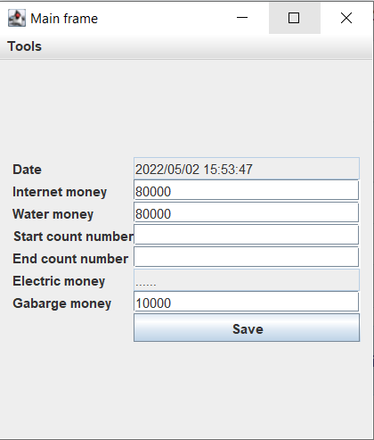
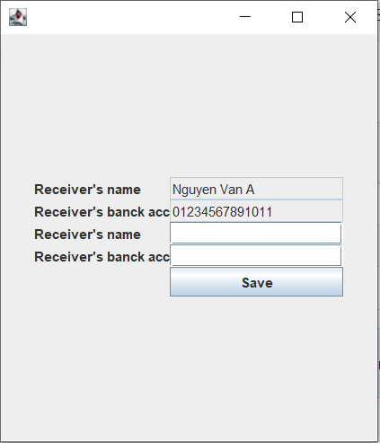
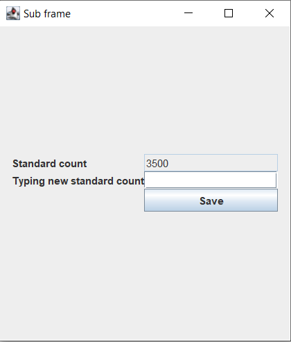
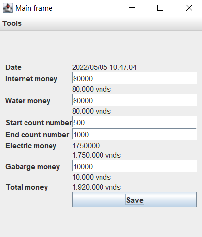
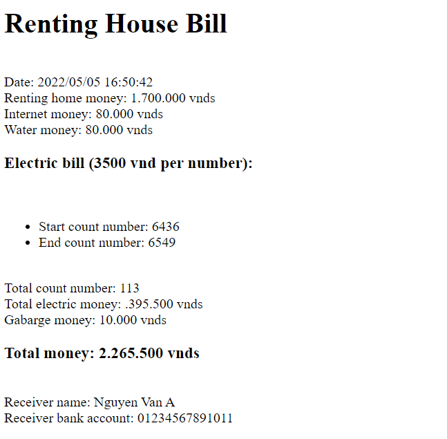

<html>

<h3>The main interface</h3>
 

<h3>Editting receiver information interface</h3>
 

<h3>The interface for editting electric money per one number</h3>
 

<h3>New main interface</h3>
 

<h3>Renting home money bill</h3>
</html>